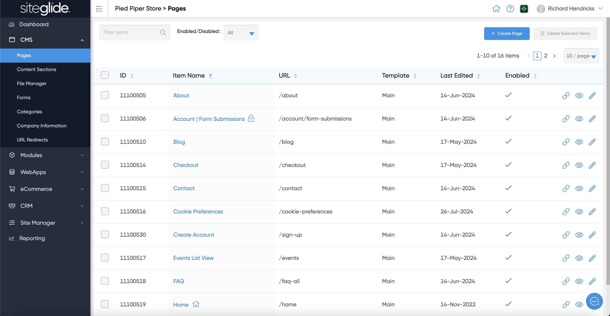
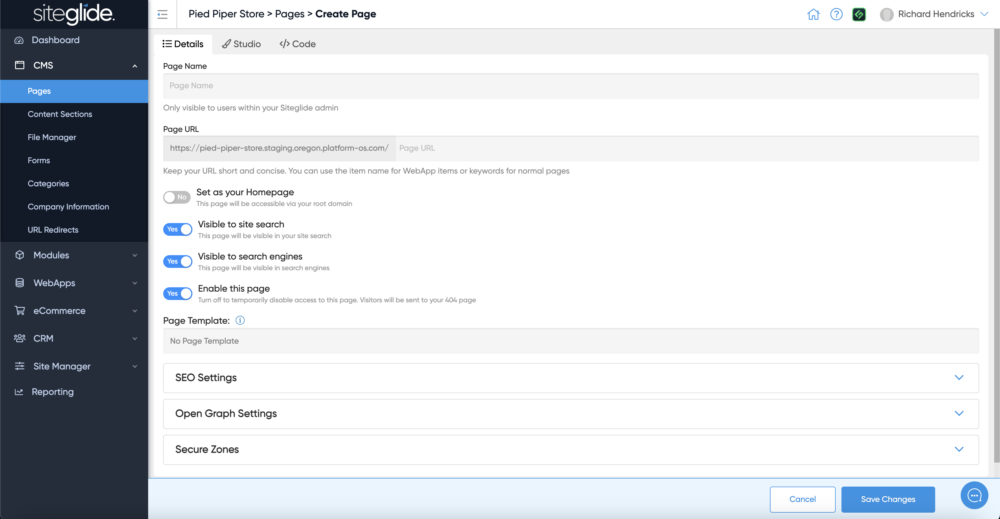

# Quickstart: Pages

## Step 1: Create a Page


You can also create pages via[Broken link](broken-reference "mention") and [cli](../../developer-tools/cli/ "mention")


To create a blank page go to CMS > Pages and click Create Page:

<figure><figcaption></figcaption></figure>

## Step 2: Page Details

Give the page a Name, it will create a URL which has to be unique (edit the Name/URL until unique):

<figure><figcaption></figcaption></figure>

You likely need to assign a Page Template, if none appear in the dropdown you'll need to create one:


[templates.md](../../site-manager2/templates.md)



Our Marketplace Templates come with Page Templates and are the easiest way to get started with Siteglide


There are various other settings including SEO meta data, Open Graph and assigning the page to a Secure Zone:


[page-settings.md](about-pages/page-settings.md)


Before adding content we recommend saving the page so that the Template is correctly linked and that Studio can display the page correctly.

## Step 3: Add Content

You have 4 ways to add content and build out pages:

**Visual Editor:** Our no-code editor for editing standard pages:


[studio-1.md](studio-1.md)


**Studio:** Our revolutionary tool that makes site building and editing a breeze:


[Broken link](broken-reference)


**Code View:** The 'code' tab allows you to write code from within Siteglide and also includes the powerful Toolbox area on the right hand side to insert content. Find out more:


[code-view-and-toolbox.md](code-view-and-toolbox.md)


**CLI:** If you're building sites and have some coding experience we strongly recommend using our CLI for code related work:


[cli](../../developer-tools/cli/)


## Step 4: Making Changes

As you add and edit content you'll likely want to use the bar at the bottom of the page to Save, View the page (as a visitor would), potentially copy the page or delete it.

There's also the 'History' tab which lets you rollback to a previous version if needed. Here, you can view and restore different versions of the Page. You can view when this version was created, by who, how this was created, and the code for this Page to decide if you’d like to restore this version.
