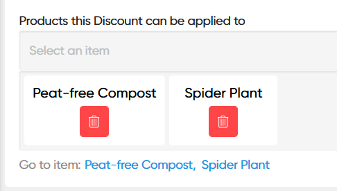

# Discounts

Discount codes can be created with a code which can be shared with selected users. They can be modified with:

* A percentage or flat value to reduce the price of the Cart, or Basic Payment Form submission.&#x20;
* A restriction of which products or product categories they apply to
* A limit to the number of uses they can have
* Expiry dates
* And more

## Creating a Discount Code

<figure><figcaption></figcaption></figure>

<figure><figcaption></figcaption></figure>

## Restricting a Discount Code to Specific Products or Categories

Sometimes you will want to give different discounts to different products or catalogues of products. This can work in Siteglide without any additional code. \
\
By default, every discount code applies to all eCommerce Checkout products. But if any products or categories are specified, the discount code will only apply to specified products and categories. \
\
At that point:

* The customer will need to spend enough on eligible products to meet the discount code's minimum spend.
* The customer will only recieve a discount on the eligible products. They can still buy other products at the same time, but they will remain full-price.&#x20;

In the "Standard Fields" tab, you can use the dropdown field labelled "Products this Discount can be applied to" to select eCommerce checkout products individually which the code should apply to.

<figure><figcaption></figcaption></figure>

In the "Categories" tab, you can select single or multiple categories to make all products which share the category (see [product-categories.md](../../../../eCommerce/get-started-ecommerce/cart-checkout-and-quotes/managing-products/product-categories.md "mention")) eligible for the discount.\
\
.png>)
