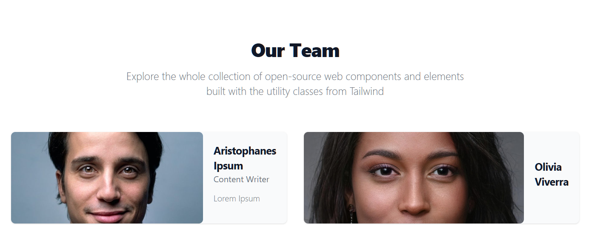

# Authors List

<figure><figcaption></figcaption></figure>

1. Make sure the Authors Module is installed.
2. Create a new page to display your list on.
3. Select a Page Template for your page.
4. Create a new Authors List Layout, or install one using the SiteBuilder Module. A list layout should:
   1. Be stored in the code editor folder: layouts/modules/module\_6/`&lt;layout\_name&gt;`/list/
   2. Contain at least a wrapper.liquid and an item.liquid file.
   3. The wrapper file should contain the code below where it should loop over each list item and output the author item.liquid file: ``
   4. The item file should contain the fields needed to display information about a specific author. You can check available data by outputting the `this` object as JSON using `{{this}}` .
5. Add a Liquid include tag to the page:
   1.  For Studio Pages either:

       1. If you created a layout using the SiteBuilder module version >= 4.19.1, you can add as a dynamic section to your page.
       2. Create an ordinary static section and add the following code inside: `` &#x20;

   2. For ordinary Pages, add the following code: `` &#x20;
