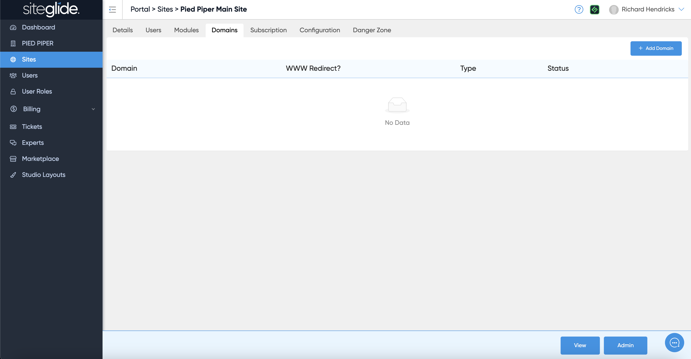
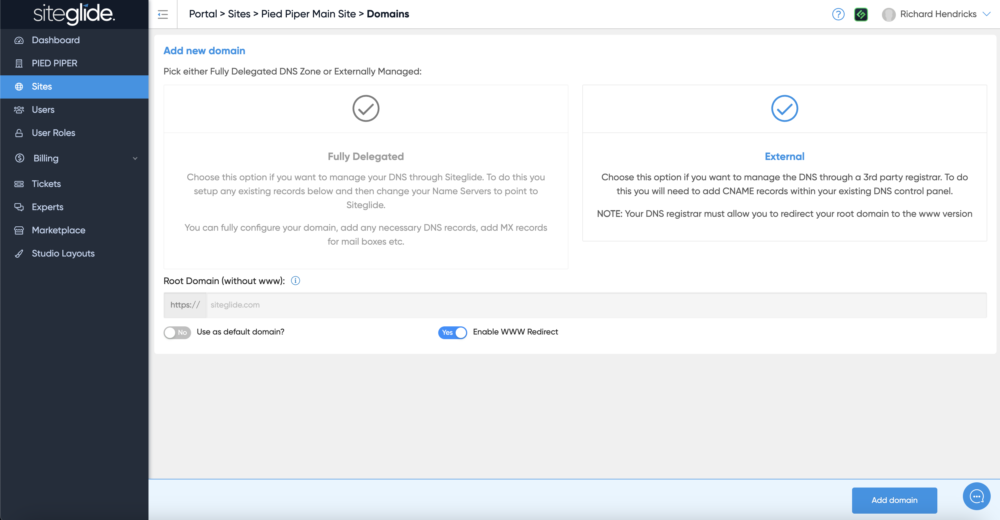
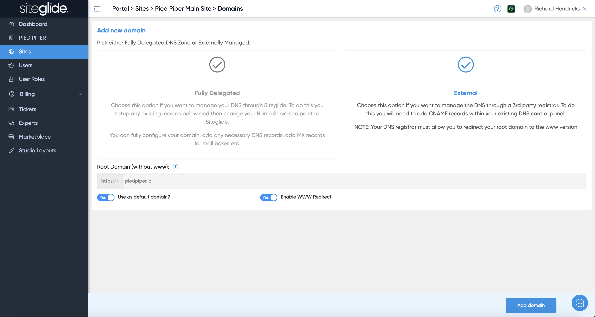
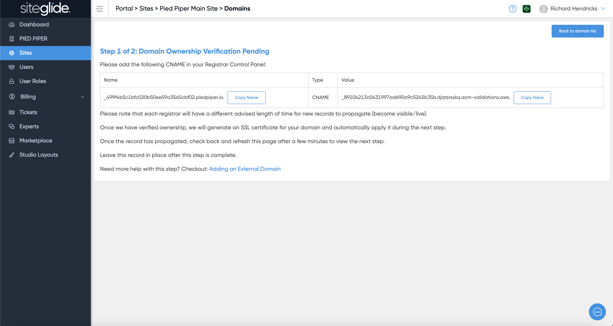
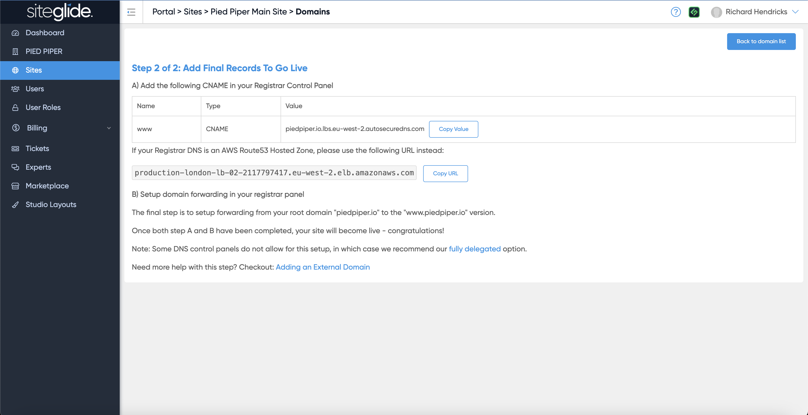
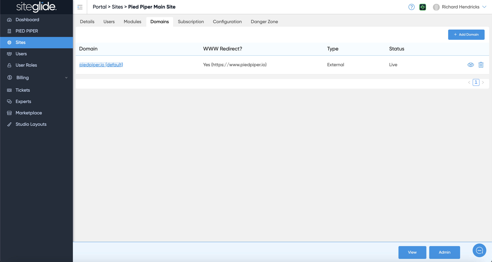
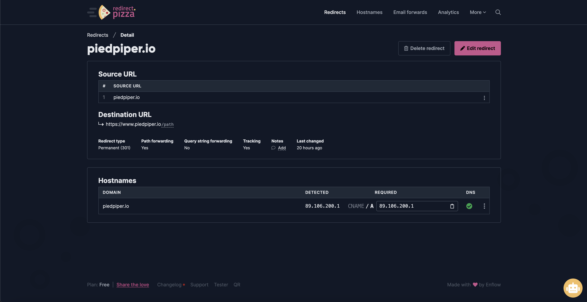
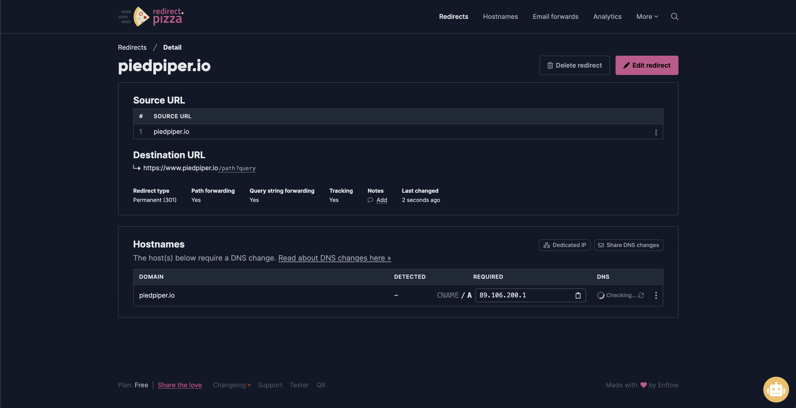
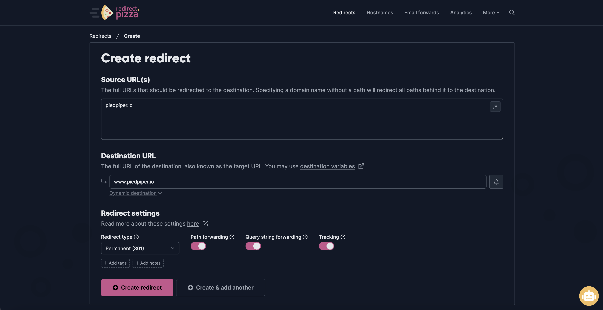

# Add an External Domain


We strongly recommend Fully Delegating your domain for best results or ensuring you use a domain control panel that allows CNAME records on the root/@ or ANAME records such as [Cloudflare](https://www.cloudflare.com/).


If you have a domain that is managed in GoDaddy or another registrar and would like to point it to a Siteglide website you can use our External Domain feature. This means that you can continue to manage your DNS through GoDaddy/other registrar.

## <mark style="background-color:orange;">Note: If using OCI (Oracle+Cloudflare)</mark>

If your site is on one of our new OCI (Oracle+Cloudflare) stacks the UI will look slightly different, you will be able to add both CNAMEs at the same time. The records are as follows (replace www.yourdomain.com with the actual domain ensuring www is included unless you're adding a subdomain):

<table><thead><tr><th width="204.2734375">Name</th><th width="90.59765625">Type</th><th>Value</th></tr></thead><tbody><tr><td>_acme-challenge.[www.yourdomain.com]</td><td>CNAME</td><td>[www.yourdomain.com].fb56597de0699182.dcv.cloudflare.com</td></tr><tr><td>www</td><td>CNAME</td><td>_fallback.uk-siteglide.com[www.yourdomain.com]</td></tr><tr><td>root/@</td><td>CNAME</td><td>_fallback.uk-siteglide.com[www.yourdomain.com]</td></tr></tbody></table>

If you cannot put a CNAME on the root we recommend switching either to our fully delegated option or using Cloudflare to manage your DNS who offer flattened CNAMEs on the root.

***

If using AWS please follow the steps below, contact us if you're unsure which stack you are on.

## Step 1: Add a Domain

Navigate to the Domains tab on the Site and click Add Domain:

<figure><figcaption></figcaption></figure>

## Step 2: Choose External

<figure><figcaption></figcaption></figure>

## Step 3: Enter Domain Details

Type in the root domain without www and you'll likely want to set it as the Default Domain and Enable WWW Redirect. Then click Add Domain:

<figure><figcaption></figcaption></figure>


**Important Note:** _Your domain can take up to a few minutes to be fully added to the system. Please check back and refresh the page shortly._


## Step 4: Add SSL Verification CNAME

Once your domain has finished creating in the system, it's status will change to "Ownership Verification Pending" which means it is now ready.

<figure><figcaption></figcaption></figure>

Add the generated CNAME record to in your DNS control panel to verify ownership, generate an SSL certificate and automatically apply it to your site during the next step.

### GoDaddy example:

Once you have saved the record in your registrar, allow some time for propagation, check back and refresh the page.


**Important Note:** _The CNAME verification record must NOT be deleted at any point otherwise the SSL certificate will not renew._


## Step 5: Add WWW CNAME Record

Once the verification CNAME record has propagated the WWW CNAME Record needs to be added in your DNS Control Panel (GoDaddy example):

<figure><figcaption></figcaption></figure>

The site will now be live via WWW (https://www.domain.com) but not via the root domain (https://domain.com). Complete Step 5 to fully setup the domain correctly. The domain should show as 'Live' under the Status column in Siteglide:

<figure><figcaption></figcaption></figure>

## Step 5: Forward the Root/@ to the www (with SSL)

Most DNS Control Panels cannot correctly redirect the root traffic to the WWW over SSL so we recommend using an external service called Redirect.Pizza.

Just follow these steps to redirect your **non-www** to the **www** variant. The non-www is also sometimes called naked record or "apex" (screenshots below):

1. Create a [redirect.pizza](https://redirect.pizza/register) account.
2. Add your source. This should be the domain without www. For instance, enter **example.com** as your source.
3. Set the destination to the variant with www. Example: **www.example.com**
4. Press "Create redirect"
5. The required DNS change pops up. Go to your domain registrar to make this DNS change for the **A** record. This record may already exists '@'. Press 'edit' to edit it to the required DNS setting for redirect.pizza. For more info, see [What are these DNS changes?](https://redirect.pizza/support/what-are-these-dns-changes)
6. The DNS change is made! It may take up to 24 hours before the DNS is fully propagated.

<figure><figcaption></figcaption></figure> <figure><figcaption></figcaption></figure> <figure><figcaption></figcaption></figure>

These Steps can also be found here: [https://redirect.pizza/support/redirecting-non-www-to-www](https://redirect.pizza/support/redirecting-non-www-to-www)
