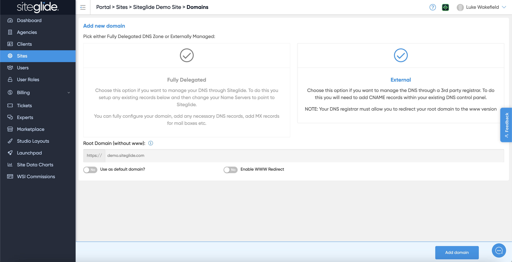

# 💻 Subdomain on a separate instance


This example is only applicable where your top level domain is fully delegated to Siteglide. If using External DNS Step 2 would not be done in Siteglide but instead wherever your DNS is managed.


You might want to have www.example.com on one Siteglide instance and app.example.com (or any other subdomain) on another Siteglide instance.

1. First add your subdomain to the second instance as a new domain:

<figure><figcaption></figcaption></figure>

1. Then go to the DNS records of your fully delegated domain and create a CNAME as follows:

| Name | Type  | Value       |
| ---- | ----- | ----------- |
| app  | CNAME | example.com |

This will use the SSL certificate from the top level domain and resolve correctly to the new instance.
