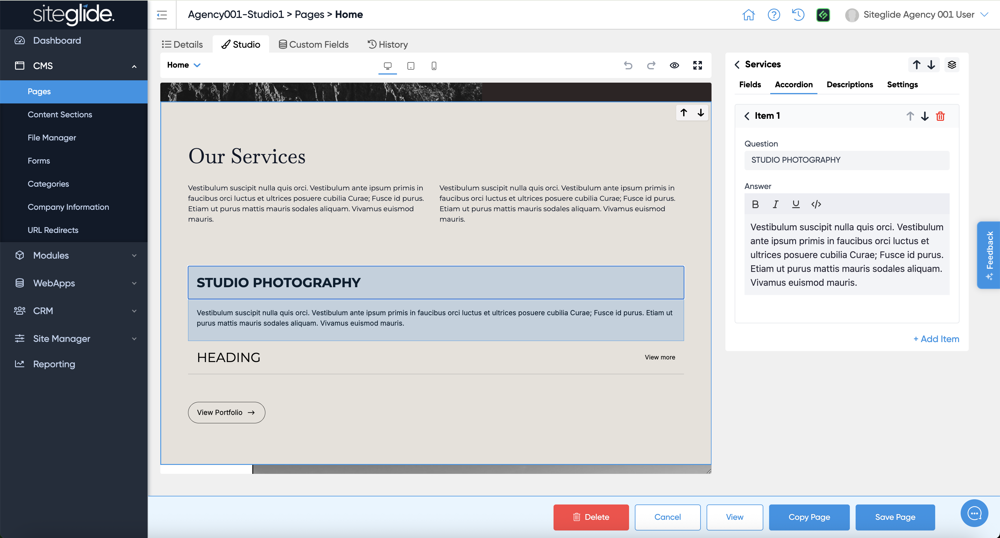
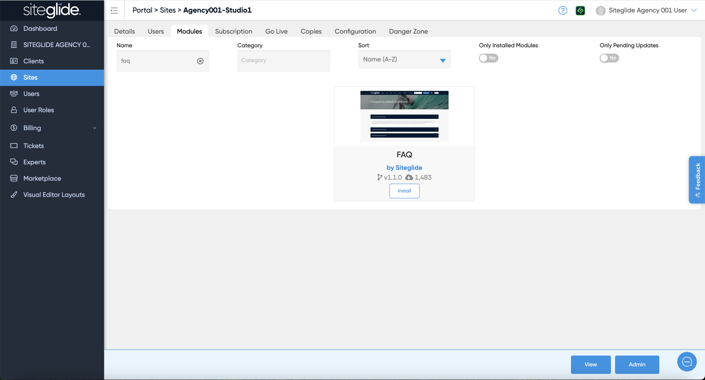
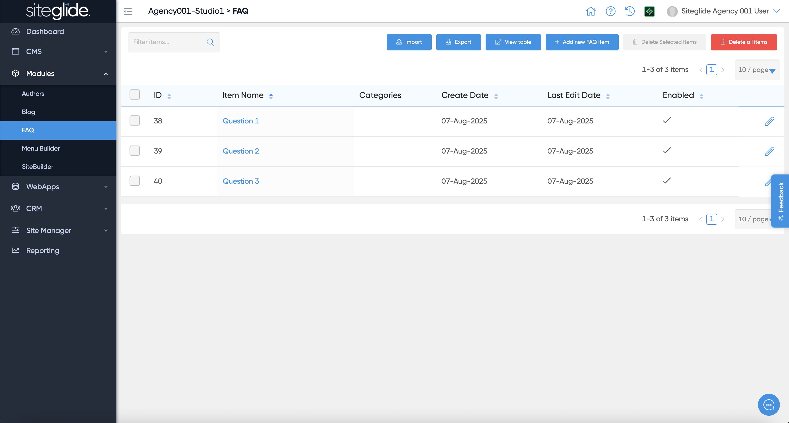
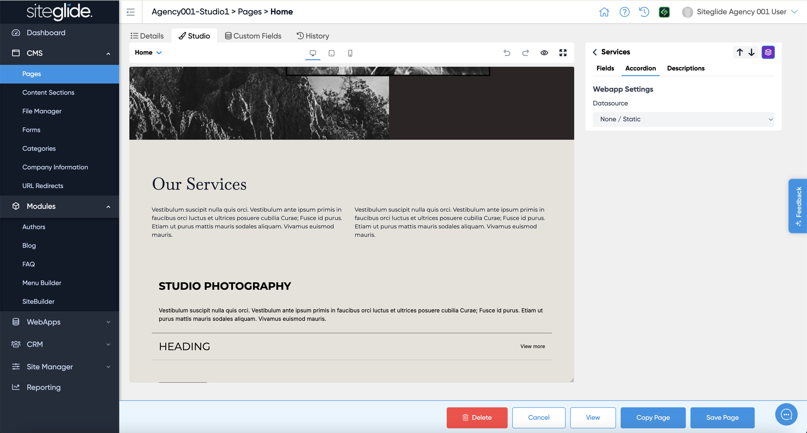
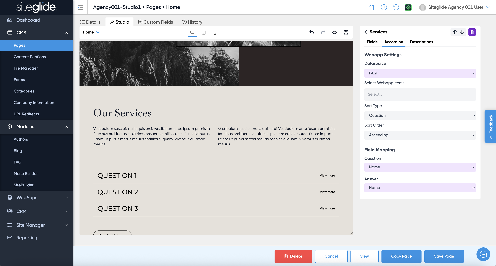

# Dynamic Content in Studio

One of the most powerful features of Studio is being able to take a static content section and make it dynamic by bringing in data from Siteglide Modules or WebApps and controlling the output.

As an example you might have a few FAQs you've manually added as a static list:

<figure><figcaption></figcaption></figure>

This works well but let's say you want to manage 10+ items and use them in other places on the site. It's far easier/better to manage that dynamically in a Module or WebApp. In this case we'll install the FAQ Module:

<figure><figcaption></figcaption></figure>

Make sure you then add some FAQ items to the Module (see guide: [quickstart-faqs.md](../../modules/core-modules/faq/quickstart-faqs.md "mention")):

<figure><figcaption></figcaption></figure>

Then in Studio click the Mapping icon (far right on the section), it will turn purple to show you're in the Mapping settings:

<figure><figcaption></figcaption></figure>

Choose your Datasource, in this case the FAQ Module:

<figure><figcaption></figcaption></figure>

You can then adjust the settings:

1. Select Items: If you don't select any they will all show
2. Sort Type: Decide which field to sort by
3. Sort Order: Ascending or Descending
4. Field Mapping: Pick which field from the Module/Database maps to which field in the Section layout

You'll see the results in realtime in the left-hand preview. Click save when ready and there you have it, a static layout pulling in dynamic content, no coding required!
