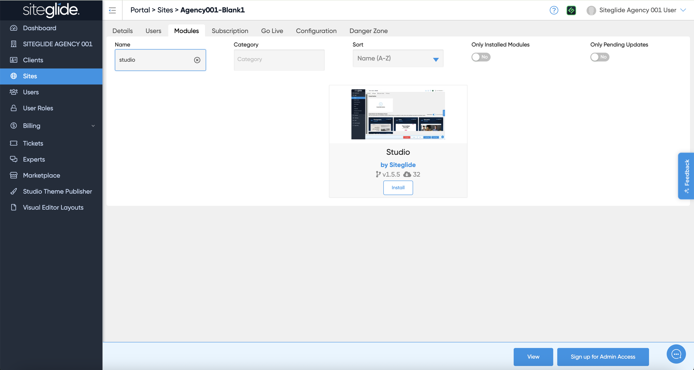

# Install Studio Module

Alternatively you might want to use Studio on an existing website or from a blank site if you don't need the whole template and all the pages.

First install the Studio Module from the Siteglide Marketplace in Portal:

<figure><figcaption></figcaption></figure>

You will likely then want to install or create a Studio Theme:&#x20;


[install-a-studio-theme.md](studio-themes/install-a-studio-theme.md)


You then setup/customise your Theme, Templates and Pages manually. Previous Siteglide experience is recommended so consider using a Site Template instead:&#x20;


[setup.md](setup.md)


Follow our interactive guide:


