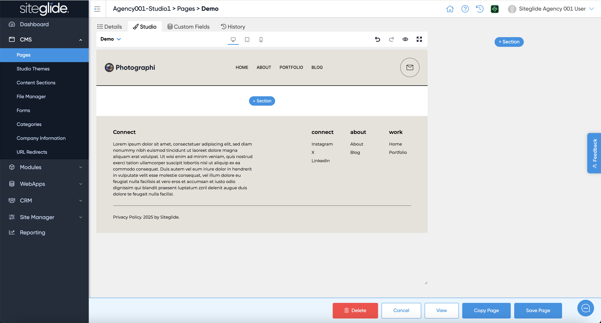
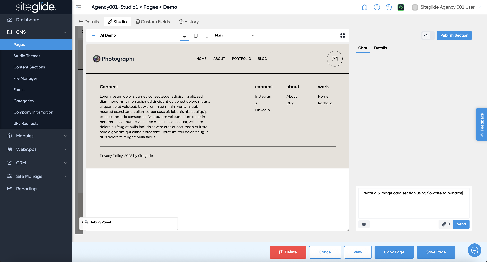
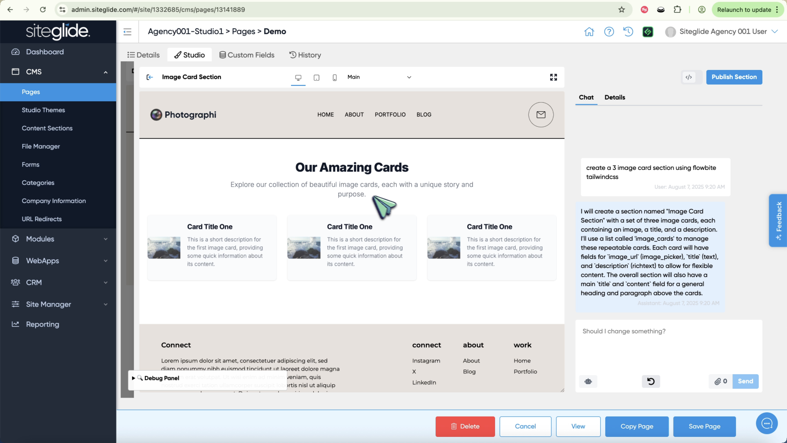
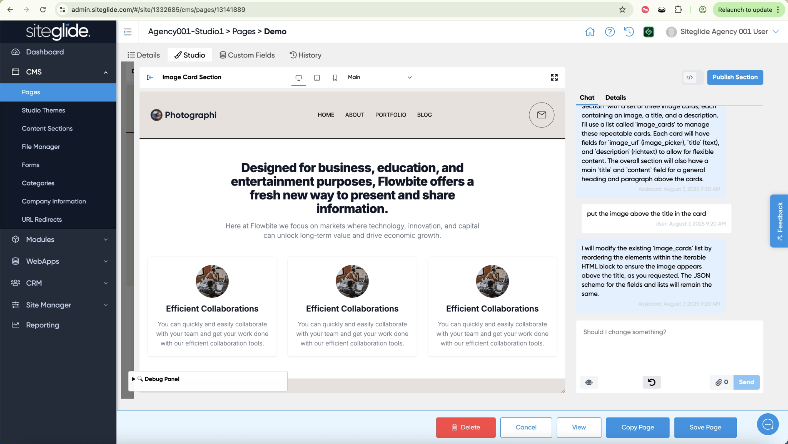
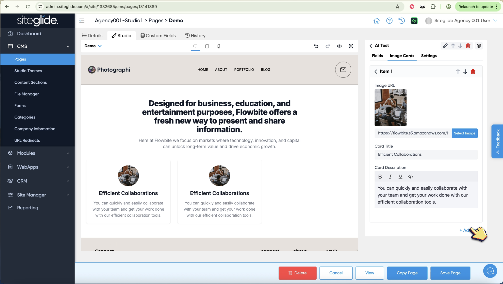
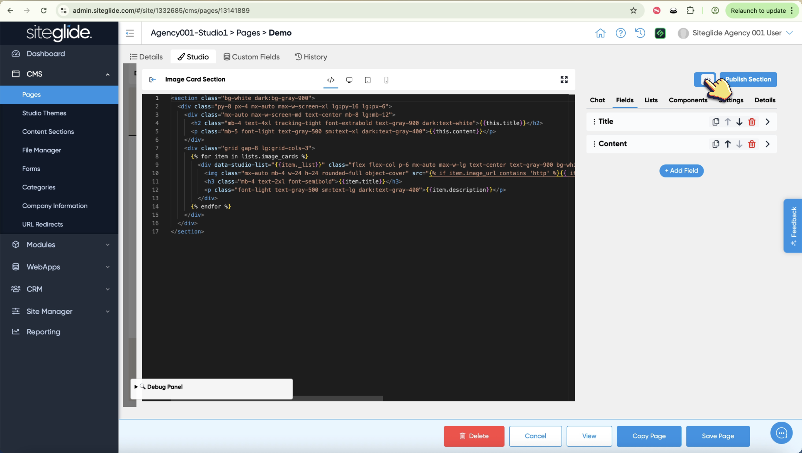

# Studio AI Section Builder

Creating websites with Siteglide has never been easier thanks to the release of Studio but also the new AI Section Builder.

You can create a completely new section to use in your Pages without touching any code by using our AI Section Builder. Simply tell the chatbot what you'd like it to build and it'll show you a preview in seconds, you can then vibe code until it's as you need!



First click the blue '+ Section' button:

<figure><figcaption></figcaption></figure>

Then click the New Section button:

<figure><figcaption></figcaption></figure>

Give it a name and category:

<figure><figcaption></figcaption></figure>

Tell the chatbot what you would like it to create:

<figure><figcaption></figcaption></figure>

The chatbot will tell you what it's done and the preview shows the results:

<figure><figcaption></figcaption></figure>

You can then vibe code making changes until you get the result you want:

<figure><figcaption></figcaption></figure>

When you're done editing click the blue 'Publish Section' button (not Save Page) and it'll save and insert the section into the Page. Then just click to edit the content:

<figure><figcaption></figcaption></figure>

If you're comfortable with code and want to get behind the scenes with how the Section works and edit the field structure or HTML layout then just click the dev toggle within the section editing UI (note you can break the layout so recommended for advanced users only):

<figure><figcaption></figcaption></figure>
