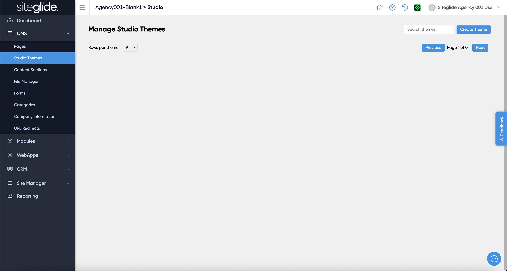

# Install a Studio Theme


Ensure the Studio module is installed: [install-studio-module.md](../install-studio-module.md "mention")


From the Admin area of a site that has the Studio Module installed head to CMS > Studio Themes and click Create Theme:

<figure><figcaption></figcaption></figure>

Here you can create a blank Theme or install from the Marketplace library of Themes:

<figure><figcaption></figcaption></figure>

Click install on your chosen Theme (or create a new one) and you'll then be able to edit the Styling or Sections areas:


[theme-styling.md](theme-styling.md)



[theme-sections.md](theme-sections.md)

