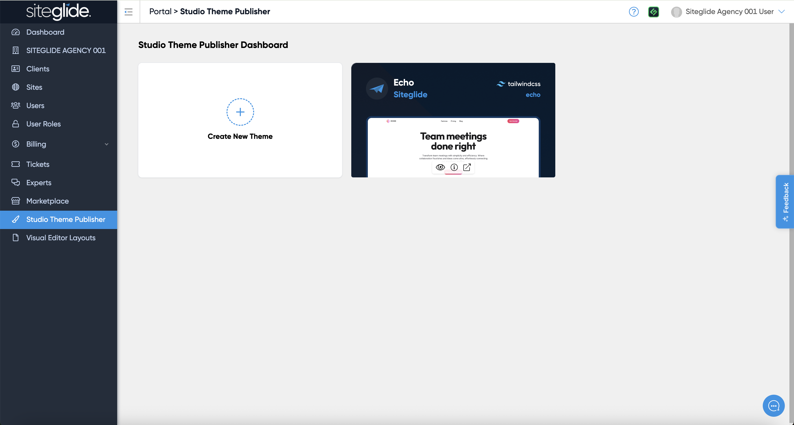
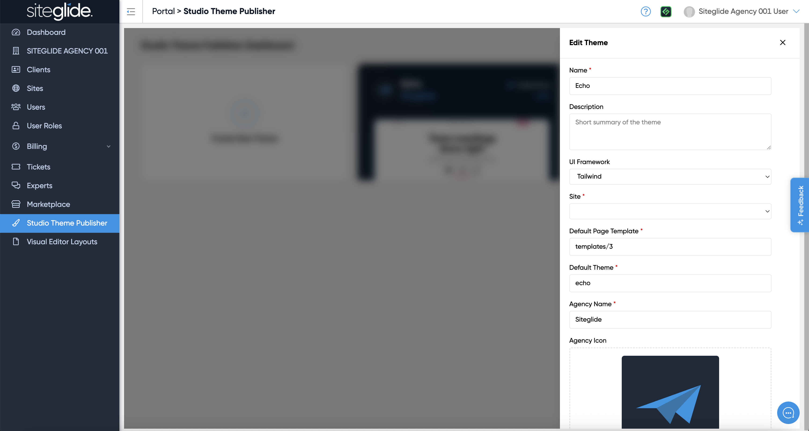

# Studio Theme Publisher

If you're wanting to create Themes you can reuse across sites or even offer/sell to the Siteglide community you will need to use the Studio Theme Publisher in Portal.


If you wish to let people start from a pre-installed Site Template you still need to also add this to the Siteglide Marketplace as normal: [site-template-modules-and-how-to-make-your-own.md](../../../developer-tools/building-for-marketplace/site-template-modules-and-how-to-make-your-own.md "mention")


Navigate to 'Studio Theme Publisher' in Portal (you will likely not see any Themes, just the Create New Theme button):

<figure><figcaption></figcaption></figure>

## Create a Marketplace Theme

Click 'Create New Theme' and fill in the details:

<figure><figcaption></figcaption></figure>

The Site is where the actual Theme has been created, any changes you make to the Theme site will be reflected on sites where the Theme has been installed.

It's important to se the correct Default Page Template and the name of the Theme set in the Theme Site in CMS > Studio Themes.
