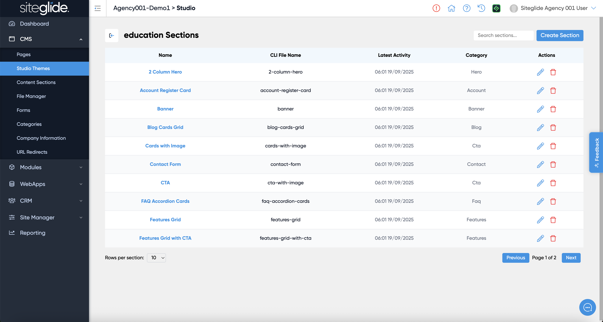

# Theme Sections

Sections are a fundamental element of how Studio works with the modular, 'brick by brick' approach. Developers write whatever code is required inside the section and then use the Studio tags to make the content editable in the Studio UI.

The Sections area is where you will find all the individual modular sections for each Theme:

<figure><figcaption></figcaption></figure>

You can manage sections here but often you might want to insert/edit/create sections from within a Page or Template because you can see the effects live on the page more easily.
