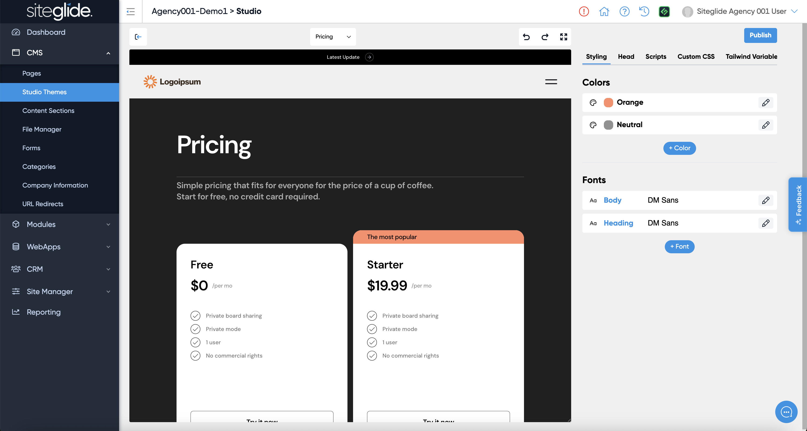

# Theme Styling


The styling options vary depending on the core framework, e.g. Tailwind or Bootstrap. Typically Tailwind offers better global styling control given it's focus on utility classes.


Control the look and feel of your Studio Templates and Pages using the built-in Colour/Font variables as well as the ability to edit the code that's applied before any Page or Template level code.

<figure><figcaption></figcaption></figure>

The Head and Scripts tabs allow you to add HTML to the head and closing body areas of all Pages and Templates that use that Theme.

The Custom CSS tab allows you to define any specific CSS to override the core framework (Tailwind, Bootstrap etc).

Finally the Tailwind Variables tab lets you override and define specific Tailwind Variables (this is only relevant when using Tailwind as your framework).

